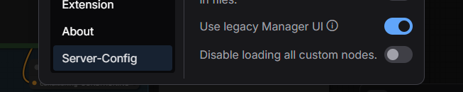

# ComfyUI Workflow Converter Endpoint

## Overview
A ComfyUI custom node that adds a `/workflow/convert` endpoint to convert non-API workflow formats to API format. The "Save (API)" client-end Javascript logic has been converted to python so it can run server-side. 

## Why is this needed?

Ok, here's the deal, you export your workflow, and from your own custom app you call ComfyUI's prompt endpoint to execute it. Well, joke's on you because it gets an error.  Why?  You can't run workflows directly, you need to choose "Export (API)" which is an option you'll only see if you've enabled developer mode for some reason.

So you think, cool, I'll just use that.  Well, it works, but later you decide you need to edit your workflow a bit and you drag and drop your "API" version into ComfyUI and low and behold, it's a skeleton of a real workflow, it's missing stuff!  You you better hope you saved a copy of the ORIGINAL full workflow.

So this solution allows you to only work with "full workflows", you just have your app do the extra step of converting the workflow to an "API" version before using it.  In my app, I check filedates and cache it out.

The result?  I no longer have to manually save two versions of my workflows to use with the API, just the "full".

(Want an example?  My Unity-based [AI Tools project](https://github.com/SethRobinson/aitools_client) requires it.  It's a project that controls ComfyUI and LLM servers to do fun stuff)

-Seth

## Disclaimer

How robust is this?  It handled all my workflows perfectly (even large 200 KB ones using Flux, Wan 2.2, etc) but your results may vary, no promises.

## Features
- Converts non-API workflows to the exact format produced by ComfyUI's "Save (API)" function
- Uses ComfyUI's actual node registry for accurate conversion
- Properly handles list and dictionary widget, subgraphs (including nested), etc
- Preserves Unicode characters (Chinese, Japanese, emojis, etc.) correctly
- Returns something that is ready to send to the `/prompt` endpoint, same as the original Javascript based web Export (API) option would've created
- Hardening: Limits requests to max 1 MB workflow size, recursion depth limit is 100, no traceback exposure to clients


## Version History

**V2.08** - Fixed GetNode/SetNode routing issue that I had with a very complex workflow with lots of subgraphs and FastGroupBypassers that results in a failed conversion

**V2.07** - Fixed subgraph internal link IDs conflicting with workflow link IDs, causing missing input connections in rare cases

**V2.06** - Security hardening: added request size limit (1 MB), input validation, recursion depth limits, and removed traceback exposure to clients

**V2.05** - Added marker node for ComfyUI Manager workflow dependency detection

**V2.04** - Fixed conversion of bypassed passthrough nodes for real

**V2.03** - Fixed conversion of bypassed kjnodes (WidgetToString, Number to Int, Text to Number) - no more "Exception when validating node" errors for bypassed nodes, target nodes now fall back to widget values when sources are bypassed (thanks to LORDofDOOM for PR #5)

**V2.02** - Fixed bug with subgraphs (thanks to v3i1y for reporting this bug), now also shows version # to the ComfyUI log when used

## Installation

### Method 1: Install via ComfyUI Manager (Recommended)

Open ComfyUI Manager and click the "Custom Nodes Manager" button. Search for "Workflow to API Converter Endpoint" and click "Install".

Note: If you're using the new Node Manager (the default with the Windows build), you might not see it. In that case, you can enable the "legacy" custom node manager and it will show up - see screenshot below:




### Method 2: Manual Git Clone
This works too - you can run this directly on the machine, or in the "Terminal" of ComfyUI

```bash
cd ComfyUI/custom_nodes
git clone https://github.com/SethRobinson/comfyui-workflow-to-api-converter-endpoint
```

### After Installation
Restart ComfyUI and the `/workflow/convert` endpoint will be automatically available.

## Usage

The endpoint is automatically available after installation. No workflow changes needed.

**Optional:** You can add the "Workflow to API Converter (Marker)" node to your workflow. This helps ComfyUI Manager detect the dependency when sharing workflows with others.

Send a POST request to `/workflow/convert` with a non-API workflow JSON (for example, one you exported from ComfyUI using "Save" not "Save (API)") to get back the API format:

```python
import json
import requests

# Load a non-API workflow JSON from disk
with open("workflow.json", "r", encoding="utf-8") as f:
    workflow = json.load(f)

# Convert to API format
response = requests.post("http://localhost:8188/workflow/convert", json=workflow)
response.raise_for_status()
api_format = response.json()

# Optionally modify parameters in api_format here (e.g., seed, model, etc.)

# Execute the API-format workflow
execute_response = requests.post("http://localhost:8188/prompt", json={"prompt": api_format})
execute_response.raise_for_status()
```


### Using curl

- Convert a non-API `workflow.json` to API format and save as `api_workflow.json` (bash/zsh):

```bash
curl -s -X POST "http://localhost:8188/workflow/convert" \
  -H "Content-Type: application/json" \
  --data-binary @workflow.json > api_workflow.json
```

## Credits

**Created by Seth A. Robinson**

- **Website**: [rtsoft.com](https://rtsoft.com)
- **YouTube**: [@RobinsonTechnologies](https://youtube.com/@RobinsonTechnologies)
- **Twitter/X**: [@rtsoft](https://twitter.com/rtsoft)
- **Bluesky**: [@rtsoft.com](https://bsky.app/profile/rtsoft.com)
- **Mastodon**: [@rtsoft@mastodon.gamedev.place](https://mastodon.gamedev.place/@rtsoft)

*This project was developed with assistance from AI tools for code generation and documentation.*
